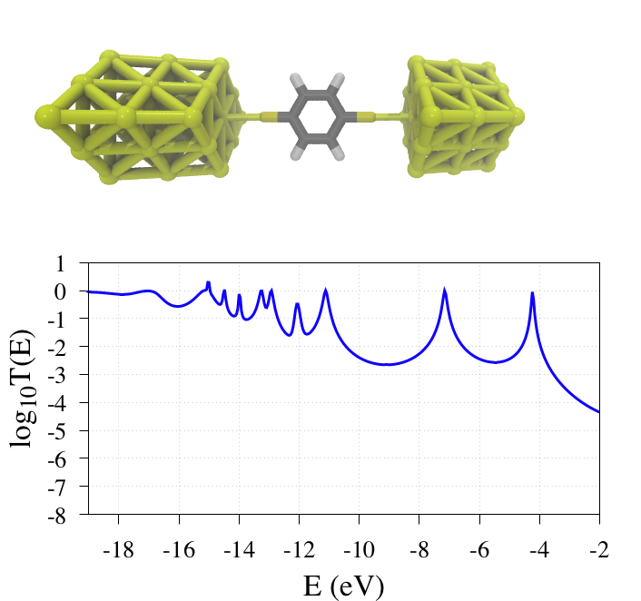

# husky.3

Husky computes the electronic transport properties of molecular junctions based on an extended Huckel electronic structure and using a non-equilibrium Green function formalism. 

# Installation

Once you've dowloaded the core, create a OBJ directory that will store the .o files. 
You have then to generate the Makefile using the script createMakefile.sh. 
Then type make and in all logic it shouldn't work. You may have to change a few #includes to locate the different library the code uses.

# Example

One example is provided. The conductance of a benzene di-thiol is computed using husky. The file husky.sh is a job file that shows how to call the executable. hsk.in contains all the information for the calculations and is self-explanatory. The file CSHAu.param contains the Huckel parameters that are used durint the calculation. A file params containing Huckel parameter for all atoms is present in SRC/huckel/. You can use these parameters for other calculations. Warning syntax in different files. If hsk.in contains Au then the parameter file should contain Au and not AU.

